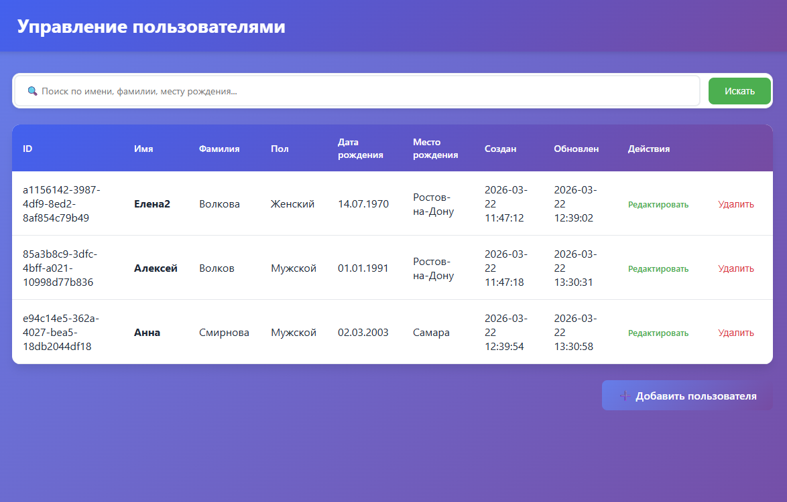
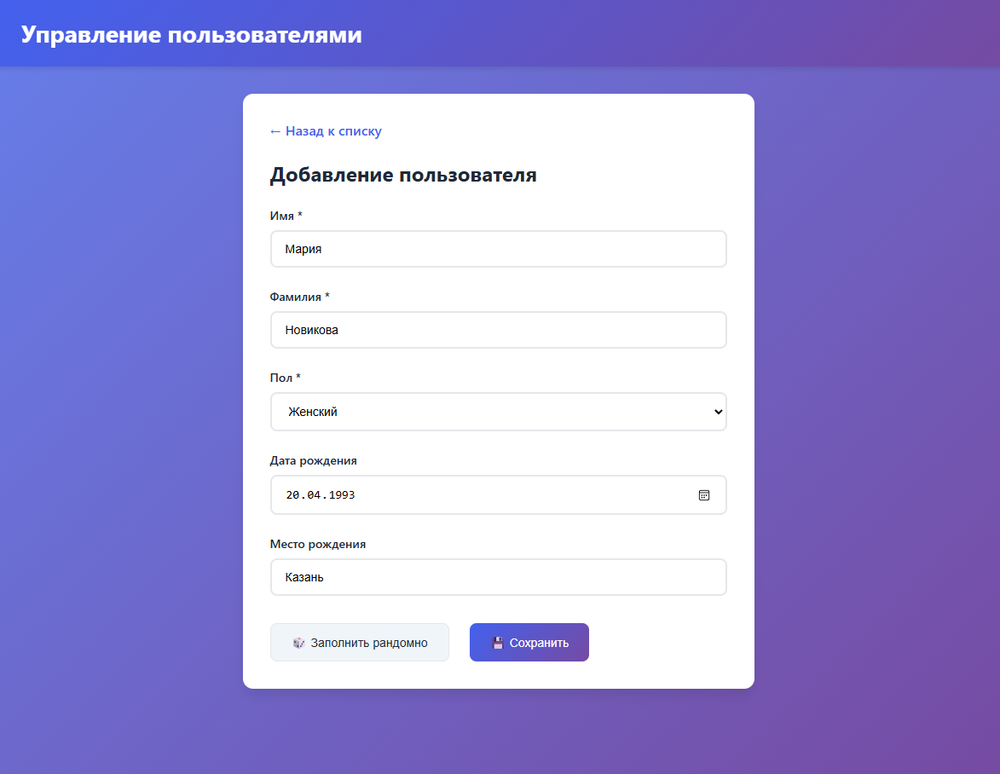

# Практическая работа №1 по предмету "Компьютерные методы в образовании, науке и производстве".

## Задание

Необходимо написать на языке PHP свой код с использованием объектно
ориентированного программирования, который реализует возможность введения 
данных о пользователе, хранения этих данных в одном файле, и поиск данных о 
пользователе по файлу для чтения или редактирования. Для этого нужно данные 
в файле хранить в форматированном виде, выделяя под каждую запись о 
человеке (например, имя человека) определенное количество символов 
(например, 20). Реализовать код, в котором можно: 
1. Внести данные о человеке (к данным относится: имя, фамилия, пол, дата 
рождения, место жительства, дата и время внесения последних изменений об 
этом человеке). Для этого использовать поля для ввода. 
2. Осуществить поиск данных о человеке по его фамилии и вывести на экран все 
данные о найденном человеке. 
3. Изменить какие-либо данные о человеке, если такой человек найден в файле 
по фамилии. При этом дата и время внесения последних изменений меняются. 
4. Удалить все данные о человеке, найдя его по фамилии. 
При написании кода нужно создать свой класс (термин из ООП), в котором будет 
описаны все возможности манипулирования при внесении/чтении данных о 
человеке. Экземпляр класса создается при формировании пользователем запроса. 
Соответственно одному экземпляру класса соответствует только одна строка 
файла. Все манипуляции с файлом описать через методы этого класса и таким 
образом осуществить инкапсуляцию. 
5. Для тех, кто хочет оценку «Отлично», реализовать дополнительную скрытую 
возможность (возможность, которая появляется при осуществлении определенных 
действий. Например, при написании слова «__admin» в поле для фамилии при 
обращении на сайт) вывести на экран содержимое этого файла с возможностью 
его редактировать и сохранить изменения.

## Как запустить

```
docker-compose -f docker-compose.yaml up
```

## Демонстрация




